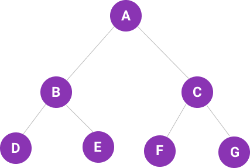
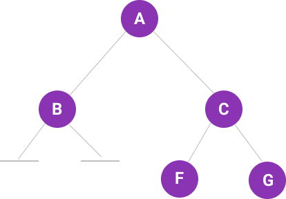
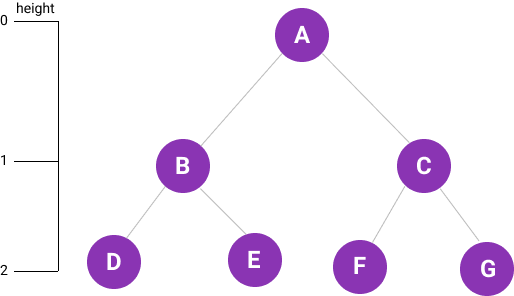
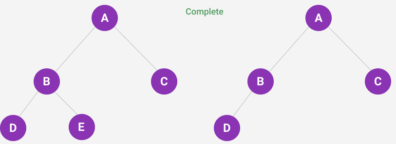
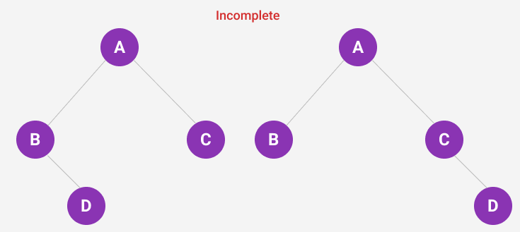
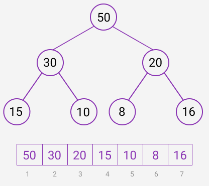
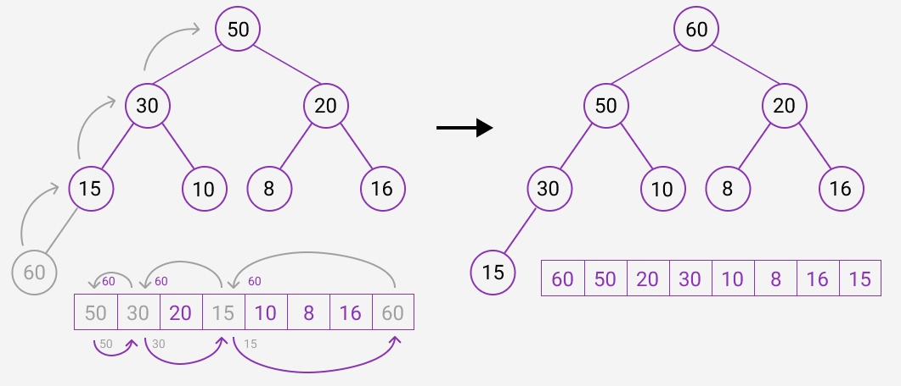

# Data Structures

## Binary Trees

A binary tree is a tree data structure in which each node has at most two children, which are referred to as the left child and the right child.

### Array Representation



If node is at index `i`

- its left child is at `i * 2`
- its right child is at `i * 2 + 1`
- its parent is at `⌊i/2⌋`

`['A', 'B', 'C', 'D', 'E', 'F', 'G']`

first position starts from `1`:

`A = 1, B = 2, C = 3, D = 4, E = 5, F = 6, G = 7`

If the nodes in the binary tree are added in the sequence of left to right, level by level as they appear in the tree, then the above formula holds true.

#### Representing Missing Nodes

When representing a binary tree in the form of an array, if there is a missing node, this should be represented as a `null|undefined` value in the array.



`['A', 'B', 'C', null, null, 'F', 'G']`

If you do not use `null|undefined` and instead add the next node value (`F`), then the formula for a binary tree will not hold true.

### Full vs Complete Binary Tree

#### Full Binary Tree

A full binary tree is one which has all possible child node for its height. This means that if the height (`h`) of the binary tree is `2` there should be nodes equalling to `2^h+1 - 1`.



`h = 2`
.˙. `2 ^ (2 + 1) - 1 = 7`

#### Complete Binary Tree

A complete binary tree is one which does not have any missing node between its first and last node. In other words, it is a full binary tree of `2^h - 1`, and the last level of node are also full from left to right.


_Complete binary tree as no node(s) is missing before final node_

Array representation:
`['A', 'B', 'C', 'D', 'E']`
`['A', 'B', 'C', 'D']`


_Incomplete binary tree as a node(s) is missing before node `D`_

Array representation:
`['A', 'B', 'C', null, 'D']`
`['A', 'B', 'C', null, null, null, 'D']`

The height of a complete binary tree will always be `log(n)`

## Binary Heap

There are two types of heaps, `max heap` and `min heap`. Both max and min heap have the following complexities.

| Method | Worse    | Average  |
| ------ | -------- | -------- |
| Insert | O(log n) | O(1)     |
| Delete | O(log n) | O(log n) |

### Max Heap

A max heap is a complete binary tree, in which every node has a value which is greater than (or equal to) all its decendants. As a result, root will have the highest value,

#### Insertion O(log n)

Inserting at the root will result in an incomplete binary tree, which breaks the rule of a heap being a complete binary tree.

Instead, elements should be inserted at the end and compared against its parent element until it is found to be greater than all its decendants.

If the newly insterted element is found to be greater than it's parent, then the values of these two elements are swapped. As a result, insertion moves the element upwards towards the root.

The formula to find the parent of a node is `⌊i/2⌋`. That is, the position of the current node divided by 2, floored.

##### Example

Max heap



Inserting `60` into max heap


Insertion has a complexity of `O(log n)` as the number of swaps (with its parent) is dependent of the height of the tree. The height of a heap, which is a complete binary tree, is `O(log n)`.

#### Deletion O(log n)

Heap are designed to organise data in such a way that the most important node is always the first (at the top as represented in a tree). This means that, when deleting an node from a heap the first node should be the node that always gets deleted.

After deleting a node, the last node node takes its place. It should be clear that at this point the heap may no longer abide by the rule of each node being greater in value than all its decendants.

To ensure the rules of a max heap, first both decendants are compared against each other. The decendant with the higher values is then compared against root and is swapped if its value is lower. This process is repeated until the last leaf node is compared, or until the node is more than or equal to the highest value of its decendants.

### Min Heap

Min heap is a complete binary tree, in which every node is smaller than (or equal to) to all its decendants. As a result, root will have the smallest value in the tree.

<!--
`[10, 30, 20, 35, 40, 32, 25]`

```
| 1 | 1 | 1 |     | 1 | 0 | 1 |
| 1 | 0 | 1 | ->  | 0 | 0 | 0 |
| 1 | 1 | 1 |     | 1 | 0 | 1 |

| 0 | 1 | 1 |     | 0 | 0 | 0 |
| 1 | 1 | 1 | ->  | 0 | 1 | 1 |
| 1 | 1 | 1 |     | 0 | 1 | 1 |
```

[[0, 1, 1],[1, 1, 1],[1, 1, 1]]

-->
